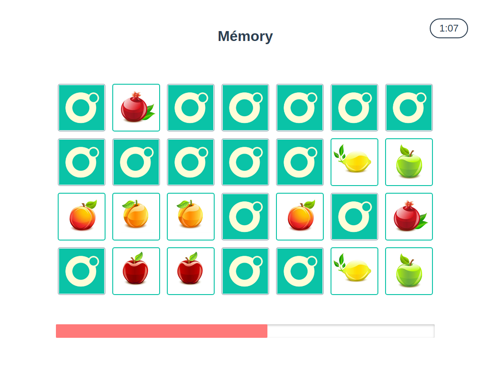
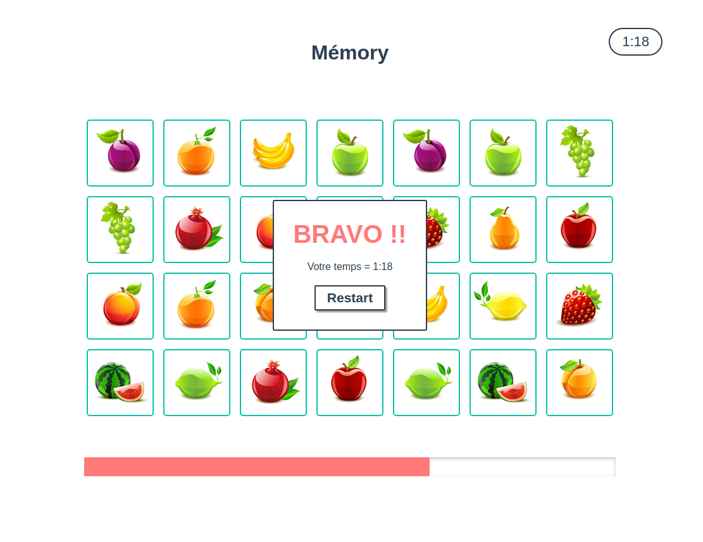
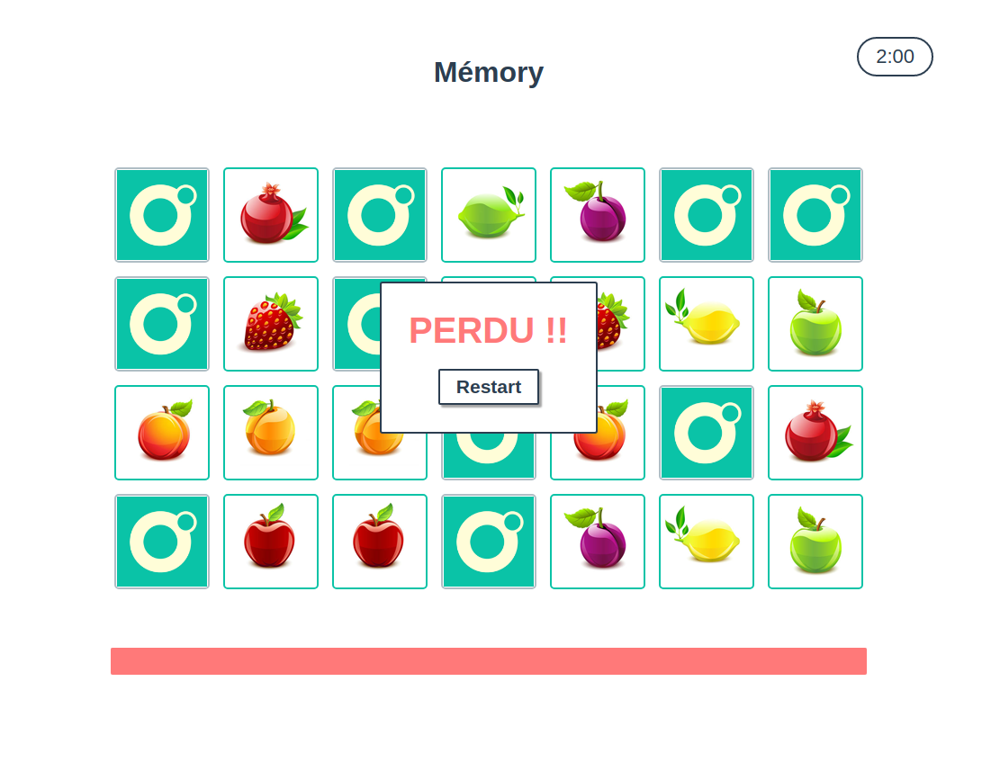
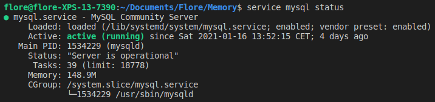

# Memory game

The classic "Memory" game : two cards of each type are placed on the screen, it's up to you to find all the pairs in the game within the time limit!
If you succeed, your score will be saved and the 3 best ones will appear at the top of the screen.

Enjoy the game!

# Screenshots

# Installation

In order to launch the project, you have to install mysql-server:

`$ sudo apt-get install mysql-server`

Then start mysql-server:

`$ sudo service mysql start`

You can check mysql-server status by running :

`$ service mysql status`

Expected output : 

Then install the project dependencies:

`$ npm install`

And start the app:

`$ node start.js`

# Built with

- vanilla JS
- pure CSS
- HTML

Server for static files : [browsersync](https://browsersync.io/)

Backend Server : [jsenv-server](https://github.com/jsenv/jsenv-server)